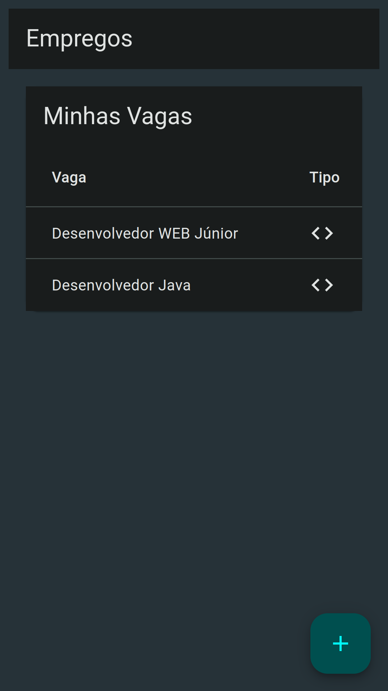

# Empregos


## Sobre

> Um sistema para que um candidato possa gerenciar as vagas em que ele está concorrendo.

Essa aplicação foi planejada para ser implementada em um servidor local, e possui o objetivo de se integrar com sistemas de automação, web scraping e afins.

## Instalação

### Dependências

Esta aplicação foi construída com:

- Docker version 24
- Docker Compose version 2.24

O restante das dependências são gerenciadas automaticamente.

### Configuração

Utilize o arquivo `.env.exemple` como exemplo para suas variáveis locais. Faça sua cópia do arquivo e altere o nome deste para `.env`, ponha os dados de sua implementação.

### Inicialização

```shell
  docker compose up
```

## Implementação

Esse projeto foi disponibilizado via a núvem gratuita da [Render](https://render.com/) e um banco de dados da [Neon](https://neon.tech/). Seu demo está disponível [aqui](https://empregos-dui6.onrender.com).

## Imagens das telas

### Mobile

<table>
  <tr>
    <td></td>
    <td></td>
  </tr>
</table>
